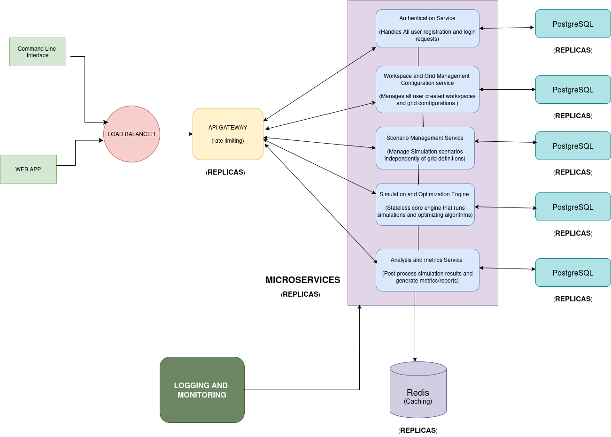

# Smart Grid Management System (SGMS)
A microservice-based platform for modeling, simulating, and managing electrical grid scenarios and events.

## Project Status
🚧 In active development

## Table of Contents
- Overview
- Problem Statement
- System Scope
- Core Concepts
- Architecture
- Repository Structure
- Services Overview
- Scenario & Event Model
- Tech Stack
- Installation
- Configuration
- Usage
- API Documentation
- Development Workflow
- Testing
- Observability
- Roadmap
- Known Limitations
- Contributing
- License
- Project Links

## Overview
SGMS enables grid operators and researchers to define grid configurations,
create immutable simulation scenarios, inject grid events (load changes,
line outages), and analyze grid behavior in a controlled environment.

## Problem Statement

Energy distribution in Cameroon is not efficient. By building this system, electrical grid operators can simulate the behavior of energy been distributed as a reaction to external or internal scenarios such line outages, load adding, islanding, solar energy drop.

## System Scope

**Included**
- User Login and Registration
- Workspace Creation
- Grid topology modeling
- Scenario creation (Immutable grid snapshot)
- Event-driven grid snapshot changes (line outages, load shedding etc.)
- Simulation-ready architecture

**Excluded**
- Real-time SCADA integration
- Physical grid control


## Core Concepts

- **Workspace**: *Collection of several grid configuration*
- **Grid**: *A physical or logical electrical network*
- **Grid Node**: *A bus or load point in the grid*
- **Grid Edge**: *Connection line between two nodes*
- **Scenario**: *A frozen configuration used for simulation*
- **Event**: *A time-based change applied to a scenario*
- **Simulation**: *Execution of a scenario with its events*

## Architecture




- API Gateway (Traefik)
- Auth Service
- Grid Configuration Service
- Scenario Management Service
- Simulation Engine Service

## Repository Structure

README.md<br>
pyproject.toml<br>
projects_distribution.pdf<br>
SGMS_SaaS_Development_Process.pdf<br>
<br>
backend/<br>
├── docker-compose.yml<br>
├── traefik/<br>
│   ├── traefik.yml<br>
│   └── acme/<br>
├── auth/<br>
│   ├── app/<br>
│   ├── alembic/<br>
│   ├── alembic.ini<br>
│   ├── Dockerfile<br>
│   ├── entrypoint.sh<br>
│   └── requirements.txt<br>
├── scenario_management/<br>
│   ├── app/<br>
│   ├── Dockerfile<br>
│   └── requirements.txt<br>
├── workspace_grid/<br>
│   ├── app/<br>
│   ├── Dockerfile<br>
│   └── requirements.txt<br>
└── data/<br>
    ├── prometheus/<br>
    └── grafana/<br>
<br>
frontend/<br>
├── app/              # Routes & pages<br>
├── components/       # Reusable UI components<br>
├── services/         # API clients<br>
├── stores/           # State management<br>
├── lib/              # Utilities & helpers<br>
├── config/           # App configuration<br>
├── public/            # Static assets<br>
├── jsconfig.json<br>
├── next.config.mjs<br>
├── eslint.config.mjs<br>
├── postcss.config.mjs<br>
├── package.json<br>
└── package-lock.json<br>
<br>
diagrams/<br>
├── SGMS_system_design.png<br>
├── auth_microservice/<br>
├── scenario_management_microservice/<br>
└── workspace_grid_microservice/<br>
<br>
documents/<br>
├── srs.pdf<br>
├── Frontend_Guide.pdf<br>
└── sgms_workflow.txt<br>
<br>
related_articles/<br>
├── applsci-08-02278-v2.pdf<br>
└── Distributed_Generation_and_Optimization_of_smart_G.pdf<br>

## Repository Explanation / Overview

The **Smart Grid Management System (SGMS)** is a modular, microservice-based platform designed to model, simulate, and analyze electrical grids using scenario-driven configurations and event-based simulations.
This repository is organized as a monorepo containing backend services, frontend application, system diagrams, documentation, and supporting research materials.

---

### Backend

The `backend/` folder contains all core microservices and infrastructure configuration required to run the system:

- **docker-compose.yml** – Orchestrates all services (databases, Redis, microservices, Traefik) for local development and testing.
- **traefik/** – Configuration for the Traefik reverse proxy, including certificate management (`acme/`).
- **auth/** – Handles user authentication, authorization, and role-based access control. Contains its own `app/`, database migrations (`alembic/`), and service dependencies.
- **scenario_management/** – Manages scenarios, scenario events, and their lifecycle (draft, locked, archived) for simulations.
- **workspace_grid/** – Responsible for grid modeling, node management, and grid-specific operations.
- **data/** – Contains persistent data directories for Prometheus (metrics) and Grafana (dashboards).

---

### Frontend

The `frontend/` folder contains the web application:

- **app/** – Routes and page definitions.
- **components/** – Reusable UI components.
- **services/** – API clients for interacting with backend microservices.
- **stores/** – State management using custom stores.
- **lib/** – Utility functions and helpers.
- **config/** – Application configuration.
- **public/** – Static assets (images, fonts, etc.).
- **Configuration & package files** – `jsconfig.json`, `next.config.mjs`, `eslint.config.mjs`, `postcss.config.mjs`, `package.json`, and `package-lock.json`.

> This structure allows the frontend to remain modular and maintainable, with clear separation of concerns.

---

### Diagrams

The `diagrams/` folder contains system architecture diagrams and microservice design references:

- **SGMS_system_design.png** – High-level system architecture.
- **auth_microservice/**, **scenario_management_microservice/**, **workspace_grid_microservice/** – Detailed microservice design diagrams.

---

### Documents

The `documents/` folder contains project documentation:

- **srs.pdf** – Software Requirements Specification.
- **Frontend_Guide.pdf** – Detailed guide for frontend development.
- **sgms_workflow.txt** – Workflow and process documentation for development and deployment.

---

### Related Articles

The `related_articles/` folder includes research papers and references that informed the design of SGMS:

- **applsci-08-02278-v2.pdf**
- **Distributed_Generation_and_Optimization_of_smart_G.pdf**


## Services Overview

| Service | Responsibility |
|------|---------------|
| Auth Service | Authentication & Authorization |
| Grid Service | Grid topology management |
| Scenario Service | Scenario Management and scenario event definition|
| Simulation Service | Stateful engine that run core simulations and optimizing algorithms |
| Metrics Service | Post process simulations results and generate metrics and reports |

## Scenario & Event Model

Scenarios progress through defined states:
- DRAFT → LOCKED → ARCHIVED

Once a scenario is LOCKED, it becomes immutable.
Any modification requires creating a new scenario.

## Tech Stack

**Backend**
- FastAPI
- SQLAlchemy
- PostgreSQL
- Redis

**Frontend**
- Nextjs
- Tailwindcss
- Javascript

**Infrastructure**
- Docker
- Traefik
- Prometheus
- Grafana
- Sentry

## Installation (Setup Instructions)

These instructions will guide you to set up a local development environment for any SGMS microservice.
All microservices share the same database and Redis URLs via Docker Compose, so you only need to provide your own third-party API keys.

---

### 1. Navigate to the microservice folder

```bash
cd backend/<microservice_name>
```
`Replace <microservice_name> with the name of the service you want to work on, e.g., auth, scenario_management, or workspace_grid.`

### 2. Create a virtual environment
```bash
# Linux / MacOS
python3 -m venv env
source env/bin/activate

# Windows PowerShell
python -m venv env
env\Scripts\Activate.ps1
```
>Activating a virtual environment ensures dependencies are isolated and do not conflict with other projects or services.

### 3. Install Dependencies
```bash
pip install --upgrade pip
pip install -r requirements.txt
```
`This will install all Python packages required for the microservice.`

### 4. Setup Environment Variables
##### 1. Copy the example environment file
```bash
cp .env.example .env.development       # Linux / MacOS
# Windows PowerShell
Copy-Item .env.example .env.development
```
##### 2. Populate the .env.development with values

```bash
Database URL (DATABASE_URL) ✅ — use the URL provided in .env.example

Redis URL (REDIS_URL) ✅ — use the URL provided in .env.example

Third-party secrets ❌ — you must provide your own keys

BREVO_API_KEY

SENTRY_DSN

Any other private API credentials

Example .env.development:

DATABASE_URL=postgresql://postgres:postgres@db:5432/auth_db
REDIS_URL=redis://redis:6379
BREVO_API_KEY=<YOUR_KEY_HERE>
SENTRY_DSN=<YOUR_DSN_HERE>
```

### 4.1. Note
> Repeat the exact same steps for all other microservices

### 5. Start all your services
> Navigate to the backend root folder where the docker-compose.yml is found
```bash
docker compose up -d
```
### 6. Check running containers
> Navigate to the backend root folder where the docker-compose.yml is found
```bash
docker compose ps
```
### 7. Install and Run the Frontend

#### 7.1 Navigate to the frontend folder

```bash
cd frontend
```

#### 7.2 Install frontend dependencies
```bash
npm install
```

#### 7.3 Setup Environment Variables

##### 7.3.1 Copy the example environment file
```bash
cp .env.example .env       # Linux / MacOS
# Windows PowerShell
Copy-Item .env.example .env
```

##### 7.3.2 Populate the .env with values
```bash
Example .env:

NEXT_PUBLIC_BACKEND_URL=http://auth.localhost/api/v1
```

#### 7.4 Run the development server

```bash
npm run dev
```
    By default, the frontend application runs on port 3000.
    If you change the frontend port, make sure to update the backend URLs in your environment variables or API clients accordingly, so that the frontend can still communicate with the backend microservices.

### 8. Fullstack System Ready
```
Once the backend services are running via Docker Compose and the frontend server is started, the fullstack SGMS system is fully operational.
You can now access the frontend on http://localhost:3000, and it will communicate seamlessly with the backend microservices for data operations, simulations, and scenario management.
```

## Usage

- API Gateway: http://localhost:8080
- Traefik Dashboard: http://localhost:8080/dashboard
- Metrics: Prometheus (http://prometheus.localhost)
- Dashboards: Grafana  (http://grafana.localhost)
- Errors Monitoring: Sentry (Sentry official website)
- OpenAPI Docs: `/docs`

## API Documentation

Each service exposes OpenAPI documentation at `/docs`.

## Development Workflow

- Conventional commits
- Pre-commit hooks enabled

## Testing

- Unit tests per service
- Integration tests via Docker

## Observability

- Metrics: Prometheus
- Dashboards: Grafana
- Proxy Metrics: Traefik
- Errors Monitoring: Sentry

## Roadmap

- Optimization algorithms
- Simulation engine integration
- Analytics and metrics service

## Known Limitations

- No real-time grid data ingestion
- Simulation engine not yet implemented

## Contributing

Contributions are welcome via pull requests.

## License

No License

## Project Links

- Repository: https://github.com/tekeufranck681/smart-grid-management-system.git
